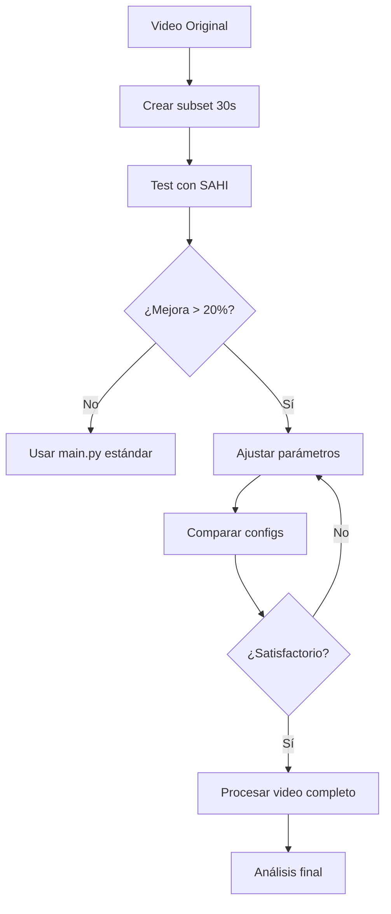

# 🚀 SAHI Quick Start Guide

Esta guía te ayudará a hacer tu primera prueba con SAHI en menos de 5 minutos.

## 📋 Prerequisitos

Asegúrate de tener Python 3.8+ instalado.

## ⚡ Instalación Rápida

```bash
# 1. Instalar dependencias (incluyendo SAHI)
pip install -r requirements.txt

# 2. Verificar que SAHI está instalado
python -c "import sahi; print(f'✅ SAHI {sahi.__version__} installed')"
```

## 🎬 Primera Prueba (30 segundos)

### Paso 1: Crear video de prueba corto

```bash
# Crear subset de 30 segundos para prueba rápida
./create_test_video.sh assets/glorieta_normal.mp4 30
```

**Salida esperada:**
```
🎬 Creating Test Video Subset
Input:    assets/glorieta_normal.mp4
Duration: 30s
Output:   assets/glorieta_normal_test_30s.mp4
✅ Test video created successfully!
```

### Paso 2: Ejecutar detección con SAHI

```bash
# Modo de prueba (solo detección, sin conteo)
python main_sahi.py \
    --mode roundabout-test \
    --video assets/glorieta_normal_test_30s.mp4 \
    --slice-height 512 \
    --slice-width 512 \
    --overlap 0.2
```

**Lo que verás:**
```
🚀 SAHI-Enhanced Car Counter
Mode: roundabout-test
Video: assets/glorieta_normal_test_30s.mp4

📊 SAHI Configuration:
  Slice size: 512x512
  Overlap: 20%
  Confidence: 0.25

🔬 Slicing Analysis:
  Tiles per frame: 12 (4x3)
  Expected slowdown: ~12x
  Estimated processing time: 2.5 minutes

⚡ Starting video processing with SAHI...

🚗 Frame 15: Detected vehicle id=1 class=car at (450,320)
🚗 Frame 28: Detected vehicle id=2 class=truck at (680,410)
...

📊 Progress: 33.3% | Frame 300/900 | FPS: 2.41 | ETA: 1m 45s
```

### Paso 3: Comparar con método estándar

```bash
# Ejecutar comparación automática
python compare_methods.py \
    --video assets/glorieta_normal_test_30s.mp4 \
    --output benchmarks/first_test.json
```

**Resultado esperado:**
```
📊 COMPARISON SUMMARY
═══════════════════════════════════════════

🔵 Standard YOLO:
  Detections: 42
  FPS: 28.50
  Time: 1.05s

🟢 SAHI Enhanced:
  Detections: 58
  FPS: 2.35
  Time: 12.77s

📈 Comparison:
  Detection improvement: +38.1%
  Additional detections: +16
  Slowdown factor: 12.1x

💡 Recommendation:
  ✅ SAHI shows significant improvement (38%)
     Worth using despite 12.1x slowdown
```

## 🎯 Próximos Pasos

### Opción A: Ajustar parámetros de SAHI

```bash
# Probar con tiles más pequeños (mejor detección, más lento)
python main_sahi.py \
    --video assets/glorieta_normal_test_30s.mp4 \
    --slice-height 384 \
    --slice-width 384 \
    --overlap 0.25

# Probar con tiles más grandes (más rápido, menos detección)
python main_sahi.py \
    --video assets/glorieta_normal_test_30s.mp4 \
    --slice-height 768 \
    --slice-width 768 \
    --overlap 0.15
```

### Opción B: Procesar video completo

```bash
# Solo si los resultados del test fueron satisfactorios
python main_sahi.py \
    --video assets/glorieta_normal.mp4 \
    --slice-height 512 \
    --slice-width 512 \
    --benchmark \
    --show-fps

# ADVERTENCIA: Esto puede tomar 2-4 horas dependiendo del video
```

### Opción C: Usar GPU (si está disponible)

```bash
# Verificar si CUDA está disponible
python -c "import torch; print('CUDA available:', torch.cuda.is_available())"

# Ejecutar con GPU (mucho más rápido)
python main_sahi.py \
    --video assets/glorieta_normal_test_30s.mp4 \
    --device cuda \
    --benchmark
```

## 📊 Interpretando los Resultados

### Video de salida

Después de la ejecución, encontrarás:
- `result_sahi.mp4` - Video con detecciones visualizadas
- `benchmarks/sahi_results.txt` - Métricas detalladas (si usaste --benchmark)

### Consola output

```python
# Durante ejecución
🚗 Frame X: Detected vehicle id=Y class=car at (x,y)

# Al finalizar
📊 FINAL SUMMARY - SAHI ENHANCED DETECTION
═══════════════════════════════════════════
🚗 Detection Results:
  Total vehicles detected: 58

  Vehicle types detected:
    car: 45
    truck: 8
    bus: 3
    motorbike: 2
```

## ❓ Troubleshooting

### Problema: "SAHI not installed"

```bash
pip install sahi>=0.11.14
```

### Problema: Muy lento en CPU

**Opciones:**
1. Reducir duración del video de prueba:
   ```bash
   ./create_test_video.sh assets/glorieta_normal.mp4 15  # Solo 15s
   ```

2. Aumentar tamaño de tiles:
   ```bash
   python main_sahi.py --slice-height 1024 --slice-width 1024
   ```

3. Usar GPU si está disponible:
   ```bash
   python main_sahi.py --device cuda
   ```

### Problema: Pocas mejoras vs YOLO estándar

**Causas posibles:**
- Video tiene vehículos grandes/cercanos (SAHI no aporta mucho)
- Confidence threshold muy alto (probar con --conf-threshold 0.2)
- Tiles muy grandes (probar con --slice-height 512 o menos)

**Solución:**
```bash
# Bajar threshold y reducir tiles
python main_sahi.py \
    --conf-threshold 0.2 \
    --slice-height 384 \
    --slice-width 384 \
    --overlap 0.25
```

## 💡 Tips para Mejores Resultados

### 1. Selección de slice size
```
Videos 1920x1080:
  - Vehículos MUY pequeños: 256x256 o 384x384
  - Vehículos pequeños: 512x512 (recomendado)
  - Vehículos medianos: 768x768
  - Vehículos grandes: No usar SAHI

Videos 4K (3840x2160):
  - Usar 512x512 o 768x768
```

### 2. Overlap óptimo
```
- 0.1 (10%): Rápido, puede perder detecciones en bordes
- 0.2 (20%): Balance recomendado
- 0.3 (30%): Más seguro para objetos muy pequeños
```

### 3. Confidence threshold
```
Con SAHI puedes usar thresholds más bajos:
- Standard YOLO: 0.3-0.4
- SAHI: 0.2-0.25 (detecta más sin aumentar false positives)
```

## 📈 Workflow Recomendado



## 📚 Documentación Completa

Para información detallada, consultar:
- **[SAHI.md](SAHI.md)** - Documentación técnica completa
- **[README.md](README.md)** - Guía general del proyecto

## 🎓 Ejemplos Avanzados

### Procesamiento por lotes
```bash
# Procesar múltiples videos
for video in assets/glorieta_*.mp4; do
    echo "Processing $video..."
    python main_sahi.py --video "$video" --benchmark
done
```

### Modo híbrido (experimental)
```python
# Solo aplicar SAHI en frames con objetos pequeños
# Ver main_sahi.py para implementación personalizada
```

### Exportar métricas
```bash
# Generar reporte comparativo
python compare_methods.py \
    --video assets/glorieta_test_30s.mp4 \
    --output benchmarks/report_$(date +%Y%m%d).json
```

---

**¿Preguntas o problemas?** Consulta SAHI.md o revisa los logs en consola.

**¡Listo para empezar!** 🚀
```bash
./create_test_video.sh assets/glorieta_normal.mp4 30
python main_sahi.py --video assets/glorieta_normal_test_30s.mp4
```
